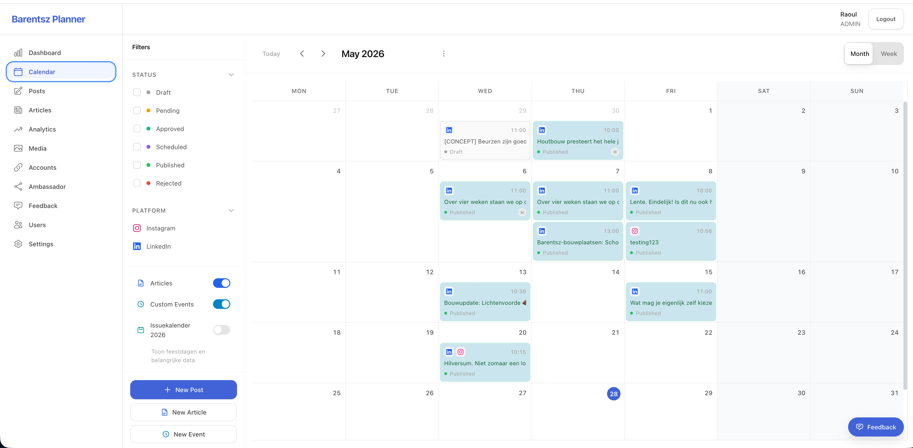
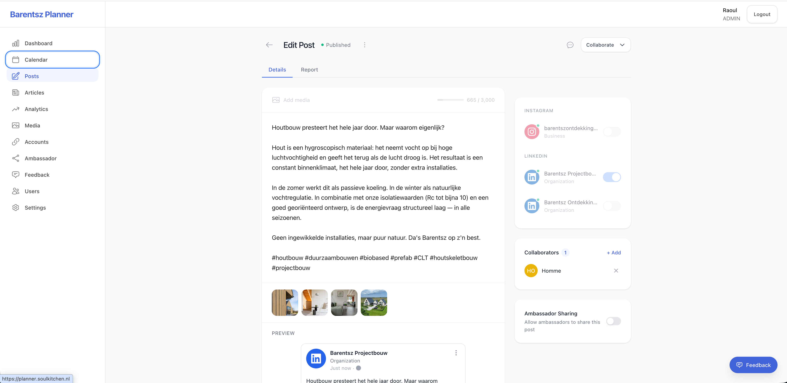

# Social Planner — MCP-connected

A social media content planner for Instagram and LinkedIn that you can drive from your own AI agent via the **Model Context Protocol (MCP)**. Schedule, draft, and approve posts from a calendar UI — or do all of it by talking to Claude or ChatGPT, with the planner exposed as a remote MCP server.

Built end-to-end with agentic coding as the primary workflow. The `memory-bank/` directory contains the full design docs, implementation plan, and session-by-session build journal used to drive Claude Code through the project.



---

## What's interesting about it

- **MCP server built into the API.** The Express app exposes an OAuth-protected MCP endpoint (`/api/mcp`) that any MCP client (Claude Desktop, Claude Code, ChatGPT, etc.) can connect to. Tools include `list_posts`, `get_post`, `create_post`, `update_post`, `schedule_post`, `submit_for_approval`, `list_channels`, and more. From inside Claude you can say _"draft a LinkedIn post about X and schedule it for Friday morning"_ and the planner does the rest — with the same approval workflow as the UI.
- **Production LinkedIn and Instagram publishing.** Real OAuth flows, real Graph/UGC API calls, token refresh, media upload through MinIO/S3, and analytics sync. Not stubs.
- **Calendar-first UX.** FullCalendar 6 with month/week/day views, drag-and-drop rescheduling, multi-channel post fan-out, and inline approval state.
- **Collaboration.** Comments, activity logs, role-based access (admin/editor/viewer), feedback widget, ambassador share-link advocacy.
- **Agentic build artifacts.** `memory-bank/app-design-document.md`, `memory-bank/technical-stack.md`, `memory-bank/implementation-plan.md`, and `memory-bank/progress.md` are the real planning and journal documents used to scaffold and ship this app with Claude Code.

## Features

### Calendar & planning

- Month and week views (FullCalendar 6) with custom event renderers, channel icons, and status pills
- Drag-and-drop to reschedule posts directly on the calendar
- Sidebar filters: saved views (All, Published & scheduled, Drafts, Social posts only, Articles only) plus advanced multi-criteria filtering (status, platform, approval, collaborator, language, custom fields)
- "Today" jump button, optional overlay of articles and custom events, optional country holiday calendar
- iCal (`.ics`) export and shareable read-only calendar links with password + expiry

### Post management

- Rich-text editor (Tiptap) with platform-aware live character counting (2,200 IG / 3,000 LI), emoji picker, link previews via OpenGraph
- Media attachments: images (JPEG/PNG/GIF/WebP) and videos (MP4/MOV), carousel reordering, per-image alt text and crop
- **Multi-channel publishing** with one post fanned out to multiple connected Instagram and LinkedIn accounts
- **Tailor by Channel** — start from one base post, then edit per-channel text/hashtags/scheduled time independently
- Three scheduling modes: Publish Now, Schedule for Later (timezone-aware picker), Save Draft
- Four tabbed list views: Drafts, Scheduled, Published (with engagement summary), Unpublished (with retry)

### Approval workflow

- Status state machine: `Draft → Pending Approval → Approved → Scheduled → Published`, plus `Rejected` and `Unpublished` branches
- "Submit for approval" + "Request edit" + "Request review" flows with in-app and email notifications
- Rejection requires a reason (returned to author with notification); approved posts require re-approval on substantive edits
- Color-coded status badges throughout the UI

### Articles (long-form)

- Rich-text article editor with headings, lists, blockquotes, code, links, and inline images with captions
- 30-second autosave, live word count
- Draft / Published lifecycle
- Article-to-post linking: posts can reference an article and render a rich preview card

### Collaboration

- Per-post collaborator assignment (searchable picker, avatars on cards)
- Threaded comments with `@mention` autocomplete and notifications
- Activity log per post (creation, status changes, edits with before/after, comments, assignments, approvals, publication)
- **Shareable review links** for external reviewers — unique-token URLs with optional password, expiry, and View / View+Comment permissions; reviewers see a clean preview UI without needing an account

### Social account connections

- OAuth flows for Instagram Business and LinkedIn (Page + Organization) with token refresh and per-account sync status
- Multiple accounts per platform; per-post channel toggles

### Analytics

- Per-post engagement rate, total engagement, impressions, and reach (where the platform provides it)
- Platform breakdowns with Instagram / LinkedIn brand styling
- Date range presets (7/30/90 days, YTD) and custom ranges; bar charts and comparison views
- PDF / print export of analytics reports

### Media library

- Drag-and-drop, file-picker, or clipboard-paste upload; per-file 50 MB images / 500 MB video limits
- Auto-generated 150px and 300px thumbnails, dimension/duration metadata extraction
- Folder hierarchy with multi-folder references, tag taxonomy, full-text search across filenames + tags
- Library asset reuse from the post editor

### Ambassador / advocacy

- Ambassador groups with email invitations (no OAuth required for ambassadors)
- "Available for Ambassador Sharing" toggle on posts surfaces them in a per-ambassador share queue
- Share tracking by ambassador / platform; aggregate metrics and per-ambassador participation rates
- Email notifications (immediate or daily digest) for new shareable content

### Auth & access

- Local accounts (bcrypt) + Google and Microsoft OAuth, with auto-link on matching email
- Short-lived access tokens (15 min) + 7-day refresh tokens
- Roles: `ADMIN`, `EDITOR`, `VIEWER` with feature-level enforcement
- Email-based invitation flow with 7-day expiry

### MCP integration

- OAuth 2.1 + PKCE-protected MCP server at `/api/mcp` — usable by Claude Desktop, Claude Code, ChatGPT, or any MCP client
- Tools: `list_posts`, `get_post`, `create_post`, `update_post`, `schedule_post`, `submit_for_approval`, `list_channels`, and more
- Pending-action confirmation flow for state-changing tools, full audit log, configurable rate limiting
- Stdio bridge script for clients that don't yet support remote HTTP MCP



### Cross-cutting

- Bilingual UI (EN + NL) via react-i18next
- Timezone-aware throughout (display + scheduling)
- In-app notification center + transactional email (MailHog locally, Resend in prod)
- Background workers (BullMQ) for scheduled publishing, analytics sync, token refresh, and notifications
- Responsive layout from mobile to desktop

## Tech stack

- **Monorepo:** Turborepo + npm workspaces
- **API:** Node.js + Express + Passport (JWT + Google/Microsoft OAuth) + Zod
- **Web:** React + Vite + TanStack Query + Zustand + Tiptap + FullCalendar + Tailwind
- **DB:** PostgreSQL via Prisma
- **Queue:** BullMQ on Redis (worker app)
- **Storage:** S3-compatible (MinIO locally)
- **Email:** MailHog (dev) / Resend (prod)
- **MCP:** OAuth 2.1 server with PKCE, tool registry, audit log, rate limiting
- **Deploy:** Docker Compose + Traefik on a single VPS
- **i18n:** react-i18next (EN + NL)
- **Testing:** Vitest (unit), Playwright (E2E)

## Prerequisites

- Node.js 20+
- Docker Desktop
- npm 10+

## Quick start

```bash
# Install dependencies
npm install

# Copy environment file
cp .env.example .env

# Start development services (PostgreSQL, Redis, MinIO, MailHog)
./scripts/init.sh

# Run migrations + seed
npm run db:migrate
npm run db:seed

# Start everything
npm run dev
```

Default seed account: `admin@admin.com` / `admin`.

> ⚠️ **Local development only.** The seed creates a hard-coded admin account purely for convenience. Never seed a deployment you don't fully control — the seed script throws if `NODE_ENV=production`, but you should still configure real auth before any non-local use.

## Development services

| Service       | URL                   | Credentials             |
| ------------- | --------------------- | ----------------------- |
| Web           | http://localhost:5173 | —                       |
| API           | http://localhost:3000 | —                       |
| PostgreSQL    | localhost:5432        | planner / planner_dev   |
| Redis         | localhost:6379        | —                       |
| MinIO Console | http://localhost:9001 | minioadmin / minioadmin |
| MailHog       | http://localhost:8025 | —                       |

## Scripts

```bash
npm run dev          # Start all development servers
npm run build        # Build all packages
npm run lint         # Lint all packages
npm run test         # Run unit tests (Vitest)
npm run test:e2e     # Run E2E tests (Playwright)
npm run db:migrate   # Run database migrations
npm run db:seed      # Seed database
npm run db:studio    # Open Prisma Studio
```

## Project structure

```
apps/
  api/                # Express REST API + MCP server (port 3000)
  web/                # React SPA (port 5173)
  worker/             # BullMQ background workers
packages/
  database/           # Prisma schema, migrations, client
  shared/             # Shared TypeScript types + Zod schemas
  ui/                 # Shared React components
docker/               # Production Docker Compose + Traefik config
memory-bank/          # Design docs, implementation plan, build journal
docs/                 # Handover docs, MCP integration guide
e2e/                  # Playwright tests
```

## Connecting the MCP server

Once running locally, the MCP endpoint is at `http://localhost:3000/api/mcp` with OAuth at `http://localhost:3000/api/mcp/oauth`. See `docs/mcp-integration.md` for the full setup — registering an MCP client, getting an access token, and adding it to Claude Desktop / Claude Code config.

## About the build

This repository is a portfolio piece showing what shipping a real, multi-feature production app with agentic coding actually looks like. The interesting reading isn't the code alone — it's the artifacts in `memory-bank/`:

- `app-design-document.md` — full feature and data-model spec written before any code
- `technical-stack.md` — tech choices with rationale
- `implementation-plan.md` — the step-by-step plan driven through Claude Code
- `progress.md` — step-by-step build log with audits at each step
- `plans/` — per-feature plans for the work added after the core was shipped

## Known advisories

`npm audit` currently reports 15 remaining advisories (8 high, 7 moderate), mostly in development tooling (`vitest` 3.x, `@typescript-eslint/*` 7.x, `esbuild`) and a few runtime transitive/direct packages (`nodemailer`, `uuid`, `bcrypt` install tooling via `tar`/`@mapbox/node-pre-gyp`). The critical advisory has been resolved. Clearing the rest requires major-version upgrades (`vitest@4`, `@typescript-eslint@8`, `uuid@14`, `nodemailer@8`), left as follow-up work for this showcase snapshot. Run `npm audit fix --force` if you want a clean audit, and re-run `npm run build && npm test` afterward.

## License

MIT — see [LICENSE](LICENSE).
